<div align="center">


**Systems programmer who builds AI agents.** Hyperloop control firmware at 11 ms E2E · a bootable x86 OS · a 49k ops/sec KV store · multi-agent orchestration in production.

[](https://linkedin.com/in/atharvaarbat)
[](mailto:arbatatharva130@gmail.com)

</div>





## `$ cat /proc/self`

CS undergrad at **MIT-WPU, Pune** (B.Tech CSE, May 2027 — CGPA 8.25). I like the layers most people avoid: I've written an operating system from the boot sector up, a lock-free KV store that speaks its own binary protocol, and firmware that held a hyperloop pod at **11 ms end-to-end latency** under live European competition. Lately I build the other extreme too — **multi-agent LLM systems running 24/7 in production**.

The three GRUB entries above aren't a joke — they're my three actual resumes. Same kernel underneath.

**Currently:** open to internships and interesting systems / AI-agent work.



## `$ systemctl status career`

### ● ovrt.service — AI Agent Engineer Intern

`Active: Jan 2026 – Jun 2026 · remote · ovrt.in`

- Built a TypeScript **multi-agent orchestrator** coordinating **6 AI agents** for Shopify automation — BullMQ queues, LangFuse tracing
- Designed a secure **Hono proxy with HMAC auth**; cut latency **20%** via connection pooling; integrated OpenAI, Sarvam AI & the Vercel AI SDK
- Shipped a **24/7 monitoring agent** with retry + exponential backoff, processing thousands of events daily

### ● vegapod.service — Navigation & Control Lead, Vegapod Hyperloop

`Active: Aug 2023 – Aug 2025 · Pune, India · EHW Zurich '24 + Groningen '25`

- Architected **MVCU** (Master Vehicle Control Unit) in C++ — multi-process, multi-threaded TCP/UART system managing real-time pod state across 4 threads at **11 ms average E2E latency** under live competition
- Designed a custom **binary wire protocol** over UART/TCP — heartbeat, CRC16 error detection, auto-reconnect; improved pod stability **40% YoY**
- Led **9 engineers**; team placed **8th / 16 globally**; owned the technical roadmap and signed off on every C++ code review



### ● byteswrite.service — Frontend Developer Intern

`Active: Aug 2024 – Nov 2024 · Pune, India`

- Built an internal ops platform (Next.js + TypeScript) from scratch; shipped to **150+ employees in 3 months**, replacing manual spreadsheet workflows
- Lighthouse **54 → 91** via SSR with ISR and route-level code splitting; load time **~4.2 s → ~2.5 s** on a throttled 3G profile
- Decomposed a monolithic UI into **35+ reusable TypeScript components**, cutting duplication ~30%

## `$ lsmod`

```text
Module            Size         Used by
auth4agent        ed25519      autonomous agents with trust issues
concurrent_kv     49k ops/s    people who benchmark against Redis for fun
arbos             32-bit       real hardware — the fans spin and everything
llm_code_review   1.8s p95     every diff that thought it was clean
huffman           180 MB/s     files that weigh too much
gym_mgmt          2 gyms       paying customers in India (both of them)
```

### [auth4agent](https://github.com/auth4agents/cli) — decentralized identity & auth for AI agents `Go · Ed25519 · JWT`

Machine-native authentication protocol for autonomous agents: DID generation, Ed25519 keypair management, and a challenge-response proof system where **private keys never leave the agent** — eliminating static API key risk. Scoped JWT issuance with JWKS, replay protection (nonce- and expiry-bound challenges), offline verification, deny-by-default operator policy. Full Cobra CLI (`init` → `register` → `issue` → `revoke` → `whoami`) plus a companion auth server with DNS-based domain verification.

### [concurrent_kv](https://github.com/atharvaarbat/concurrent-kv-go) — multi-threaded key-value store `Go · TCP`

Redis-inspired store speaking a custom binary TCP protocol: **~49,000 ops/sec**, 8-worker thread pool fed by a **lock-free MPSC queue**, O(1) LRU eviction (doubly linked list + hash map), WAL-based crash recovery. Benchmarked head-to-head with Redis via `redis-benchmark`.

### [arbos](https://github.com/atharvaarbat/arbos) — the reason this page boots `C · x86 Assembly`

A 32-bit x86 operating system running on **real hardware** and QEMU: multiboot-compliant bootloader, bitmap physical memory manager, 4 KB paging, IDT + PIC IRQ routing, PS/2 keyboard and VGA text-mode drivers over memory-mapped I/O, round-robin scheduler, minimal syscall interface.

### [llm_code_review](https://github.com/atharvaarbat/llm-code-review-agent) — agentic code review CLI `Python`

Pipes `git diff` through an LLM into structured JSON reviews `{severity, line_range, issue, fix}` across all languages. Hunk-level context chunking cuts token usage **~35%** vs. naive full-file prompting; retry + exponential backoff; **~1.8 s p95** on diffs ≤ 500 LOC.

### [huffman](https://github.com/atharvaarbat/huffman-compressor) — compression engine `C`

**42% average compression** on text at **~180 MB/s**: min-heap priority queue from scratch, canonical Huffman encoding for deterministic serialization, correct EOF padding on arbitrary binaries. Benchmarked against gzip.

### [gym_mgmt](https://github.com/atharvaarbat/gym-management) — gym management platform `Next.js · TypeScript · Prisma`

Full-stack platform **sold to and running at 2 gyms in India**: member & attendance tracking, payments, diet & workout plans, revenue analytics dashboard.

<details>
<summary><code>$ ls /opt — more in the archive</code></summary>

<br>

| Module | Stack | Description |
|---|---|---|
| [SaaS Auth Template](https://github.com/atharvaarbat/next-auth) | Next.js, Prisma | Production-ready auth starter — OAuth, passkeys, sessions |
| [Track Matching System](https://github.com/HindustanDefenceTechnologiesLimited/tracking-engine) | Python | Offline AI matching engine for Army intelligence; SBERT embeddings + ANN search (hnswlib) |
| [Raytracer Engine](https://github.com/atharvaarbat/raytracer-engine-in-c) | C, SDL2 | 2D real-time raytracing; ray-circle intersection, interactive light, shadows |
| [Custom Shell](https://github.com/atharvaarbat/arbShell) | C | Unix-like shell with `fork()`/`execvp()`, parser, built-ins |
| [XORCrypt](https://github.com/atharvaarbat/xor-encryptor) | C | File encryption with 256-bit XOR key generation; any file type |
| [Terminal Image Renderer](https://github.com/atharvaarbat/image-in-terminal) | C, stb_image | Images → colorized ASCII art in the terminal |

</details>

## `$ htop`



<details>
<summary><code>$ lspci -vv — full device tree</code></summary>

<br>

**00:01.0 — Languages**


**00:02.0 — Systems & Tools**


**00:03.0 — AI & Agents**


**00:04.0 — Web & Data**


</details>

## `$ tail -f /var/log/github`

`[  OK  ] Started telemetryd — live panels below update themselves. Zero maintenance.`

<div align="center">


<br><br>


</div>

## `$ cat /etc/contact`

<div align="center">

[](https://linkedin.com/in/atharvaarbat)
[](mailto:arbatatharva130@gmail.com)
[](https://github.com/atharvaarbat)

</div>

<details>
<summary><code>$ dmesg | grep -i panic</code></summary>

<br>

```text
[  404.000000] Kernel panic — not syncing: attention divided by zero
[  404.000001] Recovery: coffee.reload() && git push --force-with-lease
[  404.000002] System recovered. It was probably a race condition.
```

</details>

```text
$ sudo shutdown -h now
[  OK  ] Stopped ATHARVA OS.
[  OK  ] Reached target Power-Off.

It is now safe to hire the developer.
```
